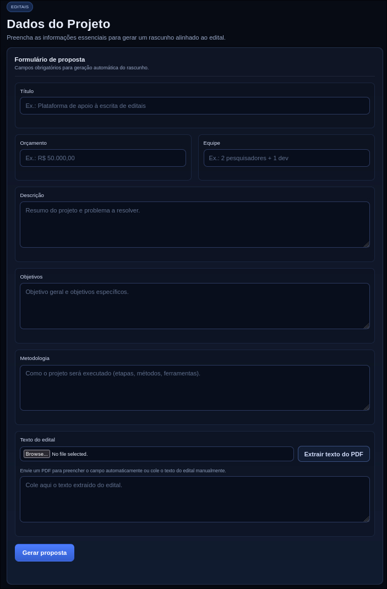

# Análise de Editais e Geração de Propostas



Este projeto visa reduzir o tempo que pesquisadores e gestores de projetos gastam escrevendo propostas de financiamento. O sistema processa um edital (em PDF ou texto), extrai seus requisitos, coleta dados do projeto do usuário e gera um rascunho estruturado e alinhado aos critérios de avaliação do edital.

## Como o Pipeline funciona

O sistema opera em quatro etapas principais:

1.  **Ingestão (Stage 1):** Extrai o texto bruto de arquivos PDF ou processa texto puro, normalizando espaços e caracteres.
2.  **Extração (Stage 2):** Utiliza LLM para identificar informações cruciais como prazos, critérios de avaliação, requisitos de formato e temas prioritários.
3.  **Geração (Stage 3):** Gera um rascunho completo do projeto com 6 seções padrão (Introdução, Justificativa, Objetivos, Metodologia, Cronograma e Orçamento), além de um checklist de conformidade.
4.  **Validação (Stage 4):** Cruza o rascunho gerado com os requisitos extraídos do edital, listando lacunas e sugestões de melhoria.

## Como Construir (Para Desenvolvedores)

### Pré-requisitos
-   Node.js >= 18
-   Uma chave de API da OpenAI (`OPENAI_API_KEY`)

### Instalação e Configuração
1.  Clone o repositório.
2.  Instale as dependências:
    ```bash
    npm install
    ```
3.  Configure as variáveis de ambiente:
    ```bash
    cp .env.example .env
    # Adicione sua OPENAI_API_KEY ao arquivo .env
    ```

### Compilação
Para compilar o código TypeScript para JavaScript:
```bash
npm run build
```

## Como Utilizar

### 1. Iniciar o Servidor
Você pode rodar o servidor em modo de desenvolvimento ou produção:
-   **Contrução de Desenvolvimento:** `npm run dev`
-   **Construção de Produção:** `npm start` (requer que o build tenha sido feito)

O servidor estará disponível em `http://localhost:3000`.

### 2. Acessar a Interface
Abra seu navegador e acesse `http://localhost:3000`. Você verá um formulário para preencher os dados do seu projeto.

### 3. Preencher os Dados
Insira as informações solicitadas:
-   **Título:** Nome do seu projeto.
-   **Orçamento:** Valor estimado necessário.
-   **Equipe:** Composição da equipe (ex: 2 pesquisadores, 1 desenvolvedor).
-   **Descrição:** Resumo do que o projeto pretende realizar.
-   **Objetivos:** O que se espera alcançar.
-   **Metodologia:** Como o projeto será executado.

### 4. Fornecer o Edital
No campo **"Texto do edital"**, cole o texto completo extraído do documento de chamada (edital). Se você tiver o edital em PDF, faça o upload do arquivo PDF pra o texto ser extraído automaticamente pelo sistema.

### 5. Gerar Proposta
Clique no botão **"Gerar proposta"**. O sistema processará as informações e utilizará inteligência artificial para criar um rascunho estruturado que você poderá utilizar como base para sua submissão.

## Documentação Técnica (API)

Para desenvolvedores que desejam integrar o sistema ou testar os endpoints diretamente, a documentação interativa (Swagger UI) está disponível em:
`http://localhost:3000/docs`

Os endpoints principais são:
-   `POST /upload`: Extração de texto de PDF.
-   `POST /extract`: Extração de requisitos estruturados de um texto de edital.
-   `POST /pipeline`: Geração completa do rascunho e checklist.
-   `POST /validate`: Validação de conformidade entre proposta e requisitos.
